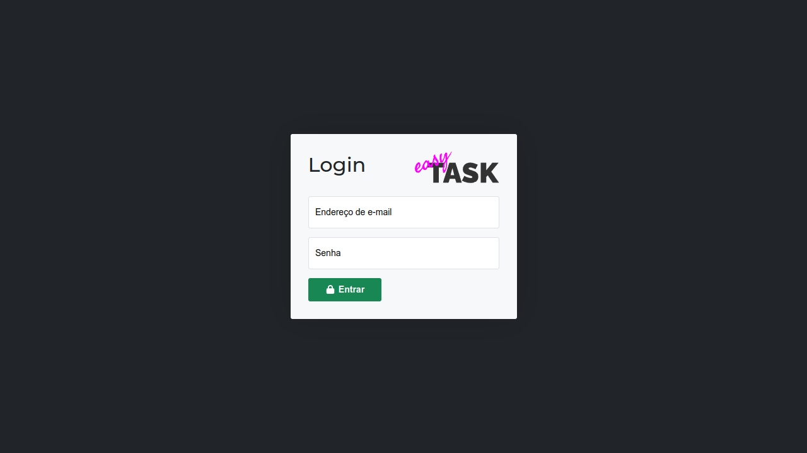

# EasyTask Front-End
## Gerenciador de Projetos de Tarefas

### Introdução
EasyTask é um gerenciador de projetos e tarefas, com suporte a gestão de usuários, atribuição de responsáveis gerenciais à projetos e atribuição de responsáveis operacionais à tarefas. Simples, direto ao ponto, responsivo, visa atender as mais diversas necessidades de gestão de demandas.

### Instalação - Front-End

#### Ambiente Local
Para executar o EasyTask Front-End em ambiente local, siga os passos abaixo:
1. Crie um arquivo `.env` na raiz do projeto, contendo a propriedade `VITE_API_URL`, que deverá conter a URL correspondente a sua API. Existe um arquivo `.env.example` que pode ser usado como referência.
2. Execute o comando `npm install` para instalar todas as dependências da aplicação.
3. Para executar em modo de desenvolvimento, execute o comando `npm run dev`.
4. Para gerar os arquivos finais da aplicação a serem hospedados em seu servidor, execute o comando `npm run build`. Dada a finalização, os arquivos finais estarão disponíveis no diretório `/build`.

#### Ambiente hospedado (servidor)
Para hospedar o EasyTask Front-End em um servidor online, é recomendado utilizar o servidor Apache. Normalmente, hospedagens compartilhadas utilizam essa aplicação para servir seus conteúdos. Atendendo a esse requisito, siga os passos abaixo:
1. Siga os passos em **Ambiente Local** para gerar os arquivos finais da aplicação.
2. Faça o upload dos arquivos finais (localizados no diretório `/build`) para seu servidor de hospedagem. Normalmente, o diretório principal contém o nome de `/public_html`, `/htdocs`, `/docroot` ou `/www`, contudo é importante consultar o suporte do seu provedor para melhores informações.

### Créditos
Toda a aplicação EasyTask Front-End foi desenvolvida por Raphael B. Fontão, e está disponível com seu código-fonte no GitHub, em [https://github.com/rbfraphael/easytask-frontend](https://github.com/rbfraphael/easytask-frontend). Sua redistribuição, modificação e demais alterações são permitidas sem a necessidade de atribuição de créditos ou direitos autorais.